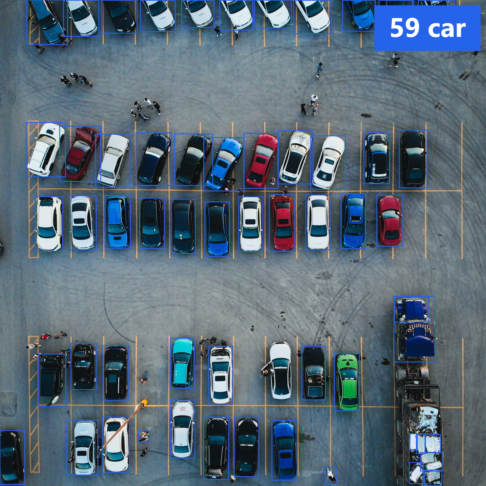
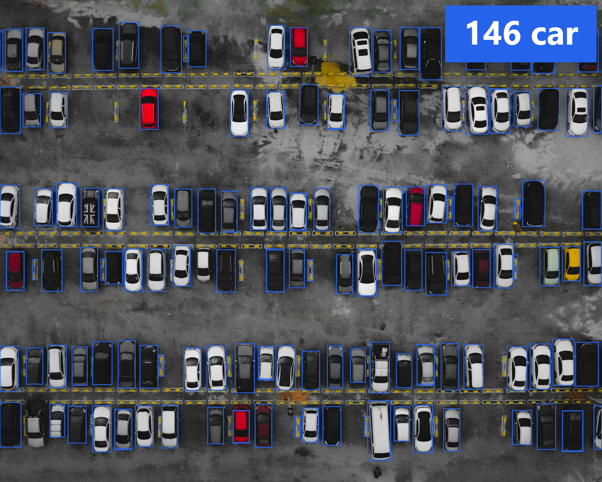
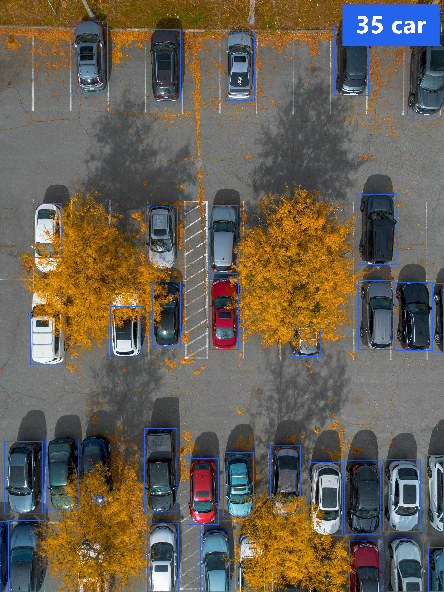
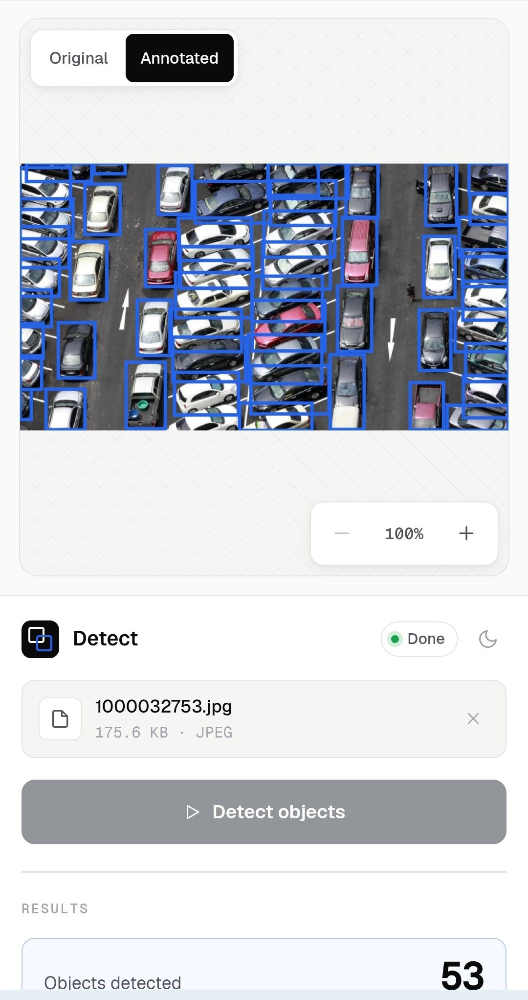

# Parking Object Detection

A full-stack computer vision service that detects **cars** in uploaded parking-scene images using a fine-tuned YOLO model. Annotated results render in real time directly in the browser — no page reload, no polling.

**Live demo →** [https://traffic.romanvestnikov.dev/](https://traffic.romanvestnikov.dev/)

---


---

## Features

| | |
|---|---|
| **1 object class** | `car` |
| **Confidence slider** | Filter detections client-side without re-running inference |
| **Annotated PNG export** | Download the image with bounding boxes burned in |
| **JSON annotation export** | Machine-readable export with per-box metadata |
| **Detection history** | All results stored in SQLite; browsable via API |
| **Dark / light theme** | Persisted across sessions |
| **Zoom & pan** | Mouse wheel + keyboard shortcuts (`+` / `-` / `0`) |
| **Responsive layout** | Works on desktop and mobile |

---

## Screenshots

Annotated inference output (`car` class only):

| Example 1 | Example 2 | Example 3 |
|---|---|---|
|  |  |  |

---

## Architecture

```
Browser
  │   drag-drop / file select
  ▼
Frontend  (React 19 + TypeScript + Vite)
  │   POST /detect  multipart/form-data
  ▼
Backend   (FastAPI + Python 3.11)
  ├─ Validation   — MIME type, size guard, decompression-bomb limit
  ├─ Inference    — Ultralytics YOLOv8, imgsz=1280, conf≥0.05
  │               — class filter: car only
  ├─ Storage      — original + annotated images under DATA_DIR/images/
  └─ Database     — SQLite via SQLAlchemy 2.0 (detection history)
  │
  ▼
Caddy     (reverse proxy — TLS termination + static frontend serving)
```

The confidence threshold slider works **entirely in the browser** — it filters the box list returned by the API without a second network request.

---

## Quick Start

### Docker (recommended)

```bash
# 1. Clone
git clone https://github.com/YOUR-USERNAME/demo-parking.git
cd demo-parking

# 2. Place your model weights
mkdir -p backend/data/models
cp /path/to/your/weights.pt backend/data/models/yolo26l.pt

# 3. Start
docker compose up --build
```

The service is available at **https://localhost:18443** (local HTTPS via Caddy's internal CA) or plain HTTP at **http://localhost:18080**.

> **Stub mode** — run without model weights to test the full pipeline with deterministic placeholder detections:
> ```bash
> MODEL_NAME=stub docker compose up --build
> ```

### Local Dev

```bash
# Backend
python -m venv .venv
source .venv/bin/activate
pip install -r backend/requirements.txt

export MODEL_NAME=stub          # or yolo if you have weights
cd backend && uvicorn app.main:app --reload --port 8000

# Frontend (separate terminal)
cd frontend && npm install && npm run dev
```

The Vite dev server proxies `/detect` and `/detections` to `localhost:8000`, so no CORS setup is needed.

Or use the convenience script from the project root:

```bash
./run.sh
```

---

## Configuration

All configuration is via environment variables (or `.env` — see `.env.example`).

| Variable | Default | Description |
|---|---|---|
| `DATA_DIR` | `./backend/data` | Root for models, images, and the SQLite database |
| `MODEL_NAME` | `yolo` | `yolo` — real inference · `stub` — deterministic placeholder |
| `MODEL_WEIGHTS` | `$DATA_DIR/models/yolo26l.pt` | Path to `.pt` weights file |
| `MAX_UPLOAD_BYTES` | `10485760` (10 MB) | Maximum accepted image size |
| `SITE_ADDRESS` | `localhost` | Caddy site address (domain for auto-TLS, `:80` for plain HTTP) |
| `HTTP_PORT` | `18080` | Host HTTP port |
| `HTTPS_PORT` | `18443` | Host HTTPS port |

---

## API

### `POST /detect`

Upload an image and receive detection results.

**Request:** `multipart/form-data` with field `image` (JPEG or PNG, max 10 MB).

**Response `200`:**
```json
{
  "success": true,
  "count": 2,
  "objects": [
    { "class": "car", "count": 2 }
  ],
  "boxes": [
    { "class": "car", "conf": 0.91, "x": 0.12, "y": 0.08, "w": 0.15, "h": 0.22 },
    { "class": "car", "conf": 0.84, "x": 0.45, "y": 0.30, "w": 0.18, "h": 0.20 }
  ],
  "image_url": "/detections/{id}/image",
  "image_width": 1610,
  "image_height": 879,
  "model_name": "yolo"
}
```

Coordinates (`x`, `y`, `w`, `h`) are normalised to `[0, 1]` relative to the image dimensions.

### `GET /detections`

List stored detections (pagination via `?skip=` / `?limit=`).

### `GET /detections/{id}/image`

Serve the annotated result image.

---

## JSON Export Format

Clicking **Download JSON** saves a structured annotation file:

```json
{
  "filename": "parking_lot.jpg",
  "image_width": 1610,
  "image_height": 879,
  "model": "yolo",
  "conf_threshold": 0.35,
  "count": 2,
  "objects": [
    { "class": "car", "count": 2 }
  ],
  "boxes": [
    { "class": "car", "conf": 0.91, "x": 0.12, "y": 0.08, "w": 0.15, "h": 0.22 },
    { "class": "car", "conf": 0.84, "x": 0.45, "y": 0.30, "w": 0.18, "h": 0.20 }
  ]
}
```

Only boxes that pass the current confidence threshold are included.

---

## Tech Stack

**Backend**
- Python 3.11, FastAPI, Uvicorn
- Ultralytics YOLO (`imgsz=1280`, CPU inference)
- SQLAlchemy 2.0 + SQLite
- Pillow (image decode + decompression-bomb guard)

**Frontend**
- React 19 + TypeScript (Vite)
- Canvas API for box overlay rendering
- CSS custom properties — no UI framework

**Infrastructure**
- Caddy (automatic TLS, static serving, reverse proxy)
- Docker Compose

---

## Testing

```bash
# Backend (46 tests, skips the YOLO smoke test that requires weights)
cd backend
pytest --ignore=tests/test_yolo_smoke.py

# Frontend (30 tests)
cd frontend
npm test
```

---

## Mobile Support

The layout adapts to narrow viewports (≤ 880 px): the canvas and sidebar stack vertically, touch targets are enlarged, and the upload zone exposes a camera-capture button on mobile browsers.

<p align="center">
  
</p>

---

## License

MIT
